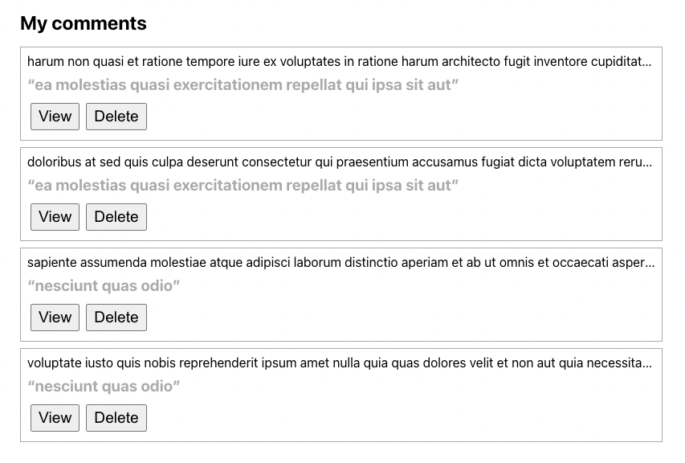

# UNE TRIMESTER 2 2022 COSC360/COSC560 Advanced Web Programming - Final Exam

## Application brief

This is a simple Blog application built with React, Express and MongoDB.

The client side consists 7 pages:
- *Home page*: List all the posts and allow the user to filter the post by keywords in the title.
- *Post details page*: Show the title and the content of the selected post, as well as its comments (folded by default). Also, allow logged-in users to add a new comment.
- *New post page*: Allow the user to create a new post.
- *Edit post page*: Allow the user to edit an existing post that belongs to them. 
- *Profile page*: List all the posts and comments from the logged-in user. 
- *Login page*: Allow the user to login.
- *Register page*: Allow the user to register a new account.

The server side provides 10 API endpoints:
- POST `/api/login`: login a user with correct username and password.
- POST `/api/register`: create a new user with username and password.
- GET `/api/posts`: get all the posts.
- GET `/api/posts/:id`: get one post with its comments by ID.
- POST `/api/posts`: create a new post.
- PUT `/api/posts/:id`: update an existing post by ID.
- DELETE `/api/posts/:id`: delete an existing post by ID.
- POST `/api/comments`: create a new comment for a post.
- DELETE `/api/comments/:id`: delete an existing comment.
- GET `/api/me`: get all the posts and comments from the logged-in user.

The application will run in a dockerized development environment. Although the `node_modules` will be installed in the containers, it is recommended to do `yarn` for both client and server apps so you will have better VSCode support when you are working locally. 

To start the project, just run `docker-compose up`. Please read this document carefully before attempting any task.

### Preset users 
- username: **foo** password: **bar**
- username: **john** password: **doe**

## Tasks

- Task 1 (3 points): Add a filter function in [Home.tsx](final-exam-client/src/pages/Home.tsx) so that the user can search post by keywords.

  Hint: just use `includes` [method](https://developer.mozilla.org/en-US/docs/Web/JavaScript/Reference/Global_Objects/String/includes) to perform the search.

- Task 2 (5 points): Complete the `handleSaveComment` function in [CommentForm.tsx](final-exam-client/src/components/CommentForm.tsx) to save a new comment. You should wrap the API call in a try catch block so any error can be handled properly. After the save succeeds, call the `onSaveSucceeded` method with the new comment's ID and content so the new comment can be immediately rendered on post details page.
  
- Task 3 (7 points): Render a list of comments in [Profile.tsx](final-exam-client/src/pages/Profile.tsx) from the logged-in user, each list item should include:
  - the comment content in [span](https://www.w3schools.com/tags/tag_span.asp) tag,
  - the commented post title in [q](https://www.w3schools.com/tags/tag_q.asp) tag, 
  - a view [button](https://www.w3schools.com/tags/tag_button.asp) that opens the post details page and unfold the selected comment automatically,  
  - a delete [button](https://www.w3schools.com/tags/tag_button.asp) that allows the user to delete the comment.

  If no previous comments, render a message "You don't have any comment..." in [p](https://www.w3schools.com/tags/tag_p.asp) tag
  
  Hint: you can pass a state as an option when calling `navigate` function.

  *Sample result for your reference:*
  
  
- Task 4 (3 points): Add a simple GET `/api/health-check` end point in [app.ts](final-exam-server/src/app.ts) to perform a server health check. The API handler just simply returns a 200 status code. To verify this, visit [http://localhost:8080/api/health-check](http://localhost:8080/api/health-check) from your browser, you should see "OK" on the page.
  
- Task 5 (5 points): Complete the post delete handler in [post.handler.ts](final-exam-server/src/handlers/post.handler.ts) with following requirements:
  - make sure the post can be found with the id in the `req.params`, otherwise, return 404,
  - make sure the post belongs to the current logged-in usr, otherwise, return 403,
  - make sure all the comments on this post are also deleted.

- Task 6 (7 points): Complete the auth register handler in [auth.handler.ts](final-exam-server/src/handlers/auth.handler.ts) with following requirements:
  - make sure the username has not been occupied, otherwise, return 400,
  - create a new user with encrypted password, use 10 as salt factor,
  - encode the user's id by using `signJwt` method, then return the token with user's id and username.

## How to submit?

1. Initialise a git repo by running `git init` at the project root.
2. Add (`git add .`) all files with your solutions and commit (`git commit -m "[your commit message]"`).
3. Run `git archive main -o [your-student-id].zip` to produce a zip file. 
4. Submit the zip file via moodle. 

Once you start the exam, you will have 36 hours to complete. Please submit on time (submit early rather than at the last seconds). 

## Note

- Make sure the port 3000 (for client), 8080 (for server) and 27017 (for MongoDB) are not occupied, otherwise, you can change the port mapping in the `docker-compose.yml` file. For example, `3001:3000` will map your local port 3001 to container port 3000. For mongoDB, you can simply shut down the local mongoDB server if it's already started.
- Both client and server `src` folders are mounted to the containers so you don't need to restart the containers to update with your changes. The dev servers are watching the changes and performing live reloading. 
- You should keep eyes on the logs from terminal or the docker desktop app in case there is any error. 
- You should **NOT** install any other dependencies. All your work will be in the `src` folders from client and server.
- You should spend some time to understand the repo before starting working on any task.
- You **DO NOT** need to complete the task in order. Don't spend too much time on one task before finishing others.
- If you cannot complete a task function, try to comment with your thinking path, so that you can still get up to 50% of the points for that task.

Good luck and happy coding!